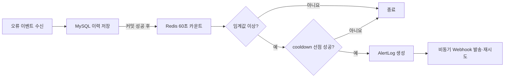

# Error Alert

애플리케이션 오류 이벤트를 수집하고, 최근 60초 동안의 급증을 감지해 운영자에게 Webhook 알림을 보내는 백엔드 시스템입니다.

> 이 저장소는 4인 팀 프로젝트 중 부트캠프 내부 문서와 민감 정보를 제외하고, 핵심 구현 코드를 포트폴리오 검토용으로 정리한 공개본입니다. 전체 프로젝트를 개인 단독 작업으로 주장하지 않으며, 개인 기여 범위는 [CONTRIBUTIONS.md](CONTRIBUTIONS.md)에 구분했습니다.

## 해결하려는 문제

단순히 오류를 저장하는 것만으로는 짧은 시간에 같은 오류가 급증하는 장애를 빠르게 발견하기 어렵습니다. 이 프로젝트는 다음 흐름으로 오류 급증을 감지하고, 동일한 알림이 반복 발송되는 문제를 줄입니다.



## 핵심 구현

- Redis Lua script와 ZSET으로 최근 60초 슬라이딩 윈도우 카운트를 원자적으로 갱신합니다.
- DB 저장 트랜잭션이 커밋된 뒤에만 Redis 카운트를 올려, 롤백된 이벤트가 감지 수치에 포함되지 않게 했습니다.
- Redis `SET NX`와 프로젝트별 TTL로 cooldown을 선점해 중복 알림을 억제합니다.
- `alert_log(project_id, error_code, window_started_at)` DB 중복 방지 규칙을 마지막 방어선으로 둡니다.
- Webhook을 비동기로 발송하고 지수 간격으로 재시도하며, 결과를 `SENT` 또는 `FAILED`로 기록합니다.
- 오류·알림 이력 필터, 최근 오류 조회, 60초 단위 오류 추이 조회를 제공합니다.
- AI 요약 전에 민감한 값을 마스킹합니다. 공개본의 AI 클라이언트는 Mock 구현입니다.

## 기술 구성

- Java 21, Spring Boot 3.3.13, Gradle
- Spring Data JPA, MySQL 8.4, Flyway
- Redis 7, Lua, Spring Async, Spring Retry
- Micrometer, Prometheus
- JUnit 5, H2, Testcontainers, Playwright

## 주요 API

| 기능 | API |
| --- | --- |
| 프로젝트 생성 | `POST /api/v1/projects` |
| 프로젝트 API 키 발급 | `POST /api/v1/projects/{projectId}/api-keys` |
| 감지 설정 변경 | `PUT /api/v1/projects/{projectId}/settings` |
| 오류 이벤트 수신 | `POST /api/v1/errors` |
| 최근 오류·필터 조회 | `GET /api/v1/errors` |
| 오류 추이 조회 | `GET /api/v1/errors/trend` |
| 알림 이력 조회 | `GET /api/v1/alerts` |
| 알림 AI 요약 | `POST /api/v1/alerts/{alertId}/summary` |

## 로컬 실행

### 요구 사항

- Java 21
- Docker Desktop 또는 Docker Engine + Docker Compose

macOS·Linux:

```bash
cp .env.example .env
./gradlew bootRun
```

Windows PowerShell:

```powershell
Copy-Item .env.example .env
.\gradlew.bat bootRun
```

기본 설정은 Docker Compose로 MySQL과 Redis를 실행합니다. 이미 실행 중인 인프라를 사용한다면 `.env`에서 `DOCKER_COMPOSE_ENABLED=false`로 바꾸고 `MYSQL_*`, `REDIS_*` 값을 설정하세요.

서버가 시작되면 `http://localhost:8080/actuator/health`에서 DB와 Redis 상태를 확인할 수 있습니다.

## 검증

```bash
./gradlew test
./gradlew performanceTestClasses
```

MySQL·Redis가 필요한 성능·동시성 테스트는 별도 Gradle task로 분리했습니다.

```bash
./gradlew recentLookupPerformanceTest
./gradlew recentFilterIndexPerformanceTest
./gradlew apiKeyConcurrencyPerformanceTest
./gradlew alertCooldownConcurrencyPerformanceTest
./gradlew redisCounterAtomicityPerformanceTest
./gradlew errorRateCounterStrategyPerformanceTest
```

실제 HTTP 사용자 흐름은 [Playwright API E2E](tests/e2e/README.md)로 검증합니다.

## 현재 한계

- 관리·조회 API는 포트폴리오 범위의 임시 역할 헤더를 사용하며, JWT 기반 인증·인가는 구현하지 않았습니다.
- Redis와 MySQL을 하나의 분산 트랜잭션으로 묶지 않았습니다. Redis 장애 시 DB 집계로 대체하는 흐름도 제외했습니다.
- Webhook 목적지는 프로젝트 설정값을 사용하므로 실제 배포 전에는 URL 검증과 내부망 접근 차단이 추가로 필요합니다.

공개 범위와 원본 프로젝트 이력 제외 사유는 [NOTICE.md](NOTICE.md)를 참고하세요.
